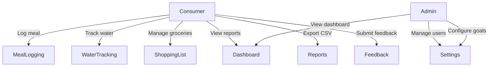
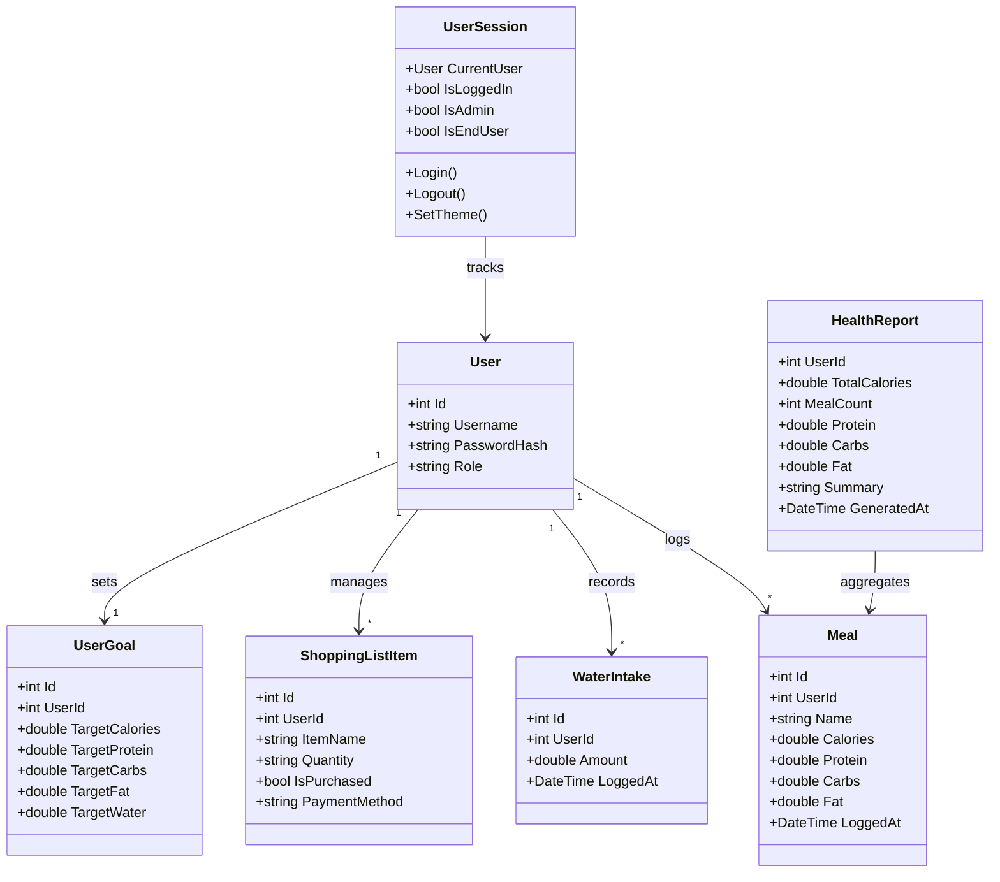
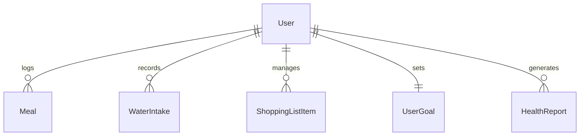

# SmartBite

> A Blazor-based health companion — meal logging, water tracking, grocery planning, and role-aware access in a single repo.

> ⚠️ **Requires .NET 10 SDK.** Earlier SDK versions are not supported.

---

## Overview

SmartBite helps end users track daily calories/macros, water intake, and groceries while giving admins control over settings and user management. The UI uses a mica/acrylic-inspired theme with light/dark toggle, sticky navigation, and CSV data exports.

---

## Feasibility Study

### Operational Feasibility
- Target users (health-conscious individuals) are familiar with web-based dashboards and mobile-responsive layouts.
- Role separation (admin vs consumer) maps directly to real-world access needs — admins manage users/settings; consumers track personal health data.
- Minimal training required: the UI follows familiar patterns (sidebar navigation, card-based dashboards, form inputs).

### Technical Feasibility
- Built on .NET 10 with Blazor Server — mature, well-documented stack with strong tooling (Visual Studio, dotnet CLI).
- In-memory database (Entity Framework Core) for rapid prototyping; swappable to SQL Server/PostgreSQL without code changes.
- JS interop (`IJSRuntime`) handles theme persistence and file downloads where Blazor alone is insufficient.

### Economical Feasibility
- All core tools are free/open-source: .NET SDK, Bootstrap, Entity Framework Core.
- Hosting can run on any machine with the .NET 10 runtime — no paid cloud dependency required for development.

---

## System Architecture

### Use Case Diagram


### Class Diagram of Proposed System


### ER Diagram


### High-Level Architectural Diagram
```
┌─────────────────────────────────────────────────┐
│                   Browser                       │
│  ┌───────────────────────────────────────────┐  │
│  │  Blazor Server (SignalR)                  │  │
│  │  MainLayout · NavMenu · Pages             │  │
│  │  UserSession · IJSRuntime interop         │  │
│  └────────────────┬──────────────────────────┘  │
└───────────────────┼─────────────────────────────┘
                    │ HTTP (SmartBiteApiClient)
┌───────────────────┼─────────────────────────────┐
│  computer_project.ApiService                    │
│  ┌────────────────┴──────────────────────────┐  │
│  │  ASP.NET Core Minimal APIs                │  │
│  │  /meals · /water · /shoppinglist          │  │
│  │  /stats · /goals · /users                 │  │
│  └────────────────┬──────────────────────────┘  │
│                   │                             │
│  ┌────────────────┴──────────────────────────┐  │
│  │  EF Core (InMemory DB)                    │  │
│  │  AppDbContext                             │  │
│  └───────────────────────────────────────────┘  │
└─────────────────────────────────────────────────┘
```

---

## Development Tools and Technologies

### Development Methodology
- Iterative/incremental: features added in vertical slices (UI + API + model per feature).
- Source control via Git on GitHub (`master` branch, feature commits).

### Programming Languages and Tools
| Tool / Language | Purpose |
| --- | --- |
| C# 14 / .NET 10 | Backend API and Blazor UI logic |
| Razor (`.razor`) | Component markup and rendering |
| HTML / CSS | Layout, styling, mica/acrylic effects |
| JavaScript | Theme toggle and file download via `IJSRuntime` |
| PowerShell / dotnet CLI | Build, restore, run, watch |
| Visual Studio 2026 Insiders | Primary IDE |
| Git + GitHub | Version control and collaboration |

### Third-Party Components and Libraries
| Library | Role |
| --- | --- |
| Bootstrap 5 | Responsive grid, buttons, cards, dropdowns |
| Bootstrap Icons | Icon set (`bi bi-*`) used across the UI |
| Entity Framework Core (InMemory) | ORM and data access for demo persistence |
| .NET Aspire (`ServiceDefaults`) | Shared service wiring and defaults |

### Algorithms
- **Macro aggregation**: server-side LINQ summation of calories, protein, carbs, fat across logged meals to produce `HealthReport`.
- **Checkout tracker simulation**: client-side stepped progress (10 stages × timed delay) with status log injection and automatic purchase-state update on completion.
- **Role-based rendering**: `UserSession` exposes `IsAdmin` / `IsEndUser` flags; components conditionally render UI blocks at the Razor level.

---

## Implementation Progress

### Development Environment Setup
1. Install .NET 10 SDK.
2. Clone the repository:
   ```bash
   git clone https://github.com/ZeroTrace0245/computer_project.git
   cd computer_project
   ```
3. Restore dependencies:
   ```bash
   dotnet restore
   ```
4. Run the API:
   ```bash
   dotnet run --project computer_project.ApiService
   ```
5. Run the UI with hot reload:
   ```bash
   dotnet watch --project computer_project.Web
   ```

### Implemented Features
| Feature | Status | Details |
| --- | --- | --- |
| Meal logging | ✅ Done | Add meals, view history, macro breakdown |
| Dashboard & reports | ✅ Done | Daily summary cards, CSV export, tips |
| Water tracking | ✅ Done | Log intakes, view history |
| Shopping list | ✅ Done | Add/delete items, payment tagging, checkout tracker |
| Role-based access | ✅ Done | Admin-only Settings; consumers blocked |
| dark theme | ✅ Done | JS interop, mica/acrylic effects |
| Feedback page | ✅ Done | Contact/help entry point |
| User registration/login | ✅ Done | Simple credential flow (demo, no hashing) |

---

## Screenshots & Demos

| View | Preview |
| --- | --- |
| Startup |  |
| Dashboard |  |
| Home |  |
| Log History |  |
| Performance |  |
| Hydration |  |
| Groceries |  |
| Settings (admin) |  |
| Settings (consumer blocked) |  |
| Support |  |
| Labs |  |
| Connection/Rejoin error |  |
| Role-based access |  |

---

## Challenges Encountered and Solutions

| Challenge | Solution |
| --- | --- |
| Blazor Server loses connection on idle/network drop | Added reconnection error UI (`blazor-error-ui`) and user-facing reload prompt |
| AI API key integration attempted but unsuccessful | Moved AI features (nutrition estimates, recommendations, chat) to future plans |
| Role checks scattered across pages | Centralised in `UserSession` (`IsAdmin`, `IsEndUser`) and reusable `<ConsumerOnly>` wrapper component |
| Theme not persisting across renders | `ApplyTheme` called via `OnAfterRenderAsync` on first render; JS interop sets `data-bs-theme` attribute |
| In-memory DB resets on restart | Seed data added in `Program.cs` and `OnModelCreating` so the app is always usable after launch |

---

## Current System Limitations
- **No persistent storage**: data lives in an in-memory database and resets on every restart.
- **No real authentication**: passwords stored in plain text; no token/cookie-based auth flow.
- **Single-user demo**: most endpoints default to `UserId = 1`; no multi-user session isolation.
- **No automated tests**: no unit or integration test projects in the solution.
- **No AI features**: Google Gemini API key was configured but did not work; AI nutrition estimates and recommendations are not functional.
- **No offline support**: Blazor Server requires a live SignalR connection; no service worker or PWA fallback.

---

## File Structure
```
computer_project.Web/              # Blazor UI
  Components/
    Layout/
      MainLayout.razor
      NavMenu.razor
    Pages/
      Home.razor
      Dashboard.razor
      Feedback.razor
      Settings.razor
      ShoppingList.razor
      MealLogging.razor
      WaterTracking.razor
      Reports.razor
      Labs.razor
      Login.razor
      Register.razor
  Services/
    UserSession.cs
  SmartBiteApiClient.cs
  Models.cs
  wwwroot/
    app.css

computer_project.ApiService/       # Backend API
  Program.cs
  Models.cs
  Data/
    AppDbContext.cs
  Services/
    AIService.cs

computer_project.ServiceDefaults/  # Shared service wiring
  Extensions.cs

computer_project.AppHost/          # Host / bootstrap
  Program.cs
```

---

## Future Plans
- **AI integration**: re-enable Google Gemini API for meal nutrition estimates, personalised recommendations, and hydration advice (API key was attempted but did not work during development).
- Replace in-memory DB with SQL Server or PostgreSQL for persistent storage.
- Add ASP.NET Core Identity or token-based authentication with password hashing.
- Implement multi-user session isolation (per-user data scoping).
- Add unit and integration test projects.
- Expand reports with trend charts and PDF/Excel export.
- Improve offline/connection handling and reconnection UX.
- Add push notifications for hydration and meal reminders.
