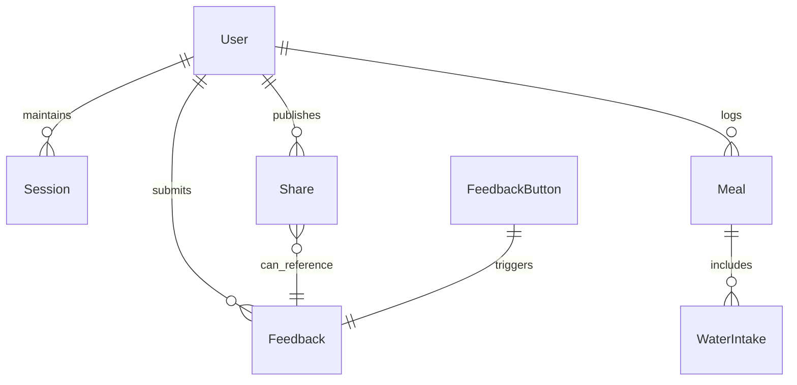

# SmartBit

Blazor app with a mica/acrylic theme. Frontend, backend API, and shared defaults live in a single repo.

> ⚠️ Requires .NET 10 SDK. Earlier SDKs are not supported.

## Overview
SmartBite is a Blazor-based health companion that combines meal logging, water tracking, and shopping list planning with role-aware access. End users track calories/macros, water intake, and groceries; admins manage settings and access control. A sticky, theme aware UI and CSV exports help users monitor progress, while feedback hooks keep the loop open.

## What the app does (features)
- Role-aware UI: admin badge and admin-only access to Settings; consumers see end-user flows only.
- Health reports: daily summaries (calories/macros) with CSV export.
- Meal logging: add and view meals, macro totals, and recent entries.
- Water tracking: log intakes and get advice.
- Shopping list: add, edit payment method, mark purchased, and delete items; checkout tracker simulation.
- Feedback/contact: capture user feedback with UI entry points (feedback button/link).
- Navigation/theme: sticky header, dark theme via `IJSRuntime`.

### Feature details
**Dashboard & reports**
- Daily macro summary cards (calories, protein, carbs, fat) with tips.
- Recent meals table and CSV export for personal data portability.
- Encouraging header message and sticky top bar to keep context visible.

**Groceries / Shopping list**
- Add items with payment method tagging (cash, card, Apple/Google Pay).
- Toggle purchased state, change payment, delete items inline.
- Checkout tracker simulation with live status logs and progress checkpoints.

**Water system**
- Log water intakes and list recent entries.

**access control**
- Role-aware rendering: admin badge, Settings page restricted to admins; consumers blocked from Settings.


## Prerequisites
- .NET 10 SDK
- Git


## Projects
- `computer_project.Web` — Blazor UI, layout, routing, SmartBite API client.
- `computer_project.ApiService` — backend API and shared models.
- `computer_project.ServiceDefaults` — common service wiring/extensions.
- `computer_project.AppHost` — hosting/bootstrap for the solution.

## Quickstart
```bash
# Clone
git clone https://github.com/ZeroTrace0245/SmartBit.git
cd SmartBit

# Restore
dotnet restore

# Run API (adjust URL/port as needed)
dotnet run --project (Path to the computer_projec.ApiService) (Ed-"G:\git\SmartBit\computer_project.ApiService")

# Run UI with hot reload
dotnet watch --project (Path to the computer_project.Web) (Eg-"G:\git\SmartBit\computer_project.Web")
```

## File structure (key paths)
```
computer_project.Web/            # Blazor UI
  Components/
    Layout/
      MainLayout.razor
      NavMenu.razor
    Pages/
      Home.razor
      Dashboard.razor
      Feedback.razor
      Settings.razor
      ShoppingList.razor
  Services/
    UserSession.cs
  SmartBiteApiClient.cs
  Models.cs
  wwwroot/
    app.css

computer_project.ApiService/     # Backend API
  Program.cs
  Models.cs
  Data/
  Services/

computer_project.ServiceDefaults/ # Shared service wiring
  Extensions.cs

computer_project.AppHost/         # Host/bootstrap
  Program.cs
```

## Tech stack
| Area | Technology | Notes |
| --- | --- | --- |
| UI | Blazor (`.razor` components) | Layout, routing, role-aware UI (admin badge, quick actions). |
| Styling | Bootstrap 5 + custom CSS (`wwwroot/app.css`) | Mica/acrylic-inspired surfaces, responsive sidebar/header. |
| Client interop | `IJSRuntime` | Theme toggle and other JS hooks. |
| State/Auth | `UserSession` service | Tracks login, roles, theme, and change notifications. |
| API client | `SmartBiteApiClient` (`HttpClient`) | Calls backend endpoints for data and feedback. |
| Backend | ASP.NET Core (`computer_project.ApiService`) | API + shared models. |
| Hosting | .NET 10 | CLI-driven build/run. |

## Tooling & services
- .NET CLI (`dotnet restore`, `dotnet run`, `dotnet watch`)
- Git + GitHub for source control
- ASP.NET Core Minimal APIs (in-memory database for demo)
- Bootstrap 5 for layout and components
- JS interop via `IJSRuntime` for theme toggles and file download

## Screenshots & Demos
| View | Path |
| --- | --- |
| Startup |  |
| Dashboard |  |
| Home |  |
| Log History |  |
| Performance |  |
| Hydration |  |
| Groceries |  |
| Settings (when logged as an admin) |  |
| Settings (when logged as consumer) |  |
| Support |  |
| Labs |  |
| Connection/Rejoin error |  |
| Role-based access (admin vs consumer) |  | 
| Role-based access (admin vs consumer) |  |


## ER diagram


## Contributing focus areas
- Layout/theming consistency (mica/acrylic, dark/light toggle)
- Nav/menu and sticky header behavior
- Session/auth and role-aware UI (admin badge, quick actions)
- Feedback form and SmartBite API client hardening
- Role-based access: admin-only Settings page; consumers are blocked from Settings.

## Future plans
- Persist data with a real database provider and authentication/authorization store.
- Add end-to-end tests for role-based routing and protected pages.
- Enhance feedback flow with backend storage and notifications.
- Expand reports with trends, charts, and export formats (PDF/Excel).
- Improve offline/connection handling and reconnection UX.
