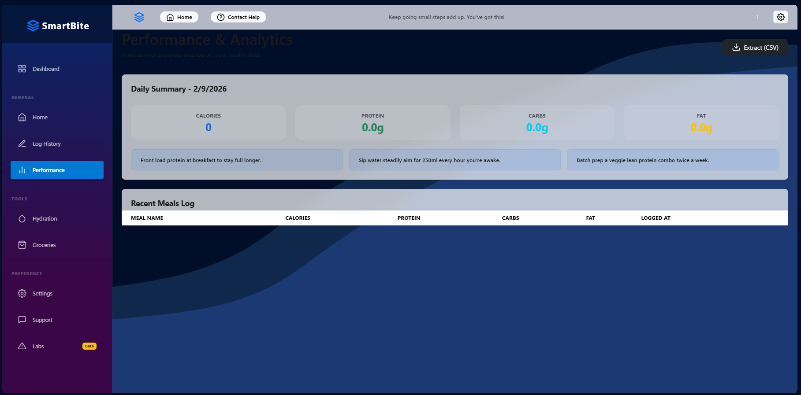
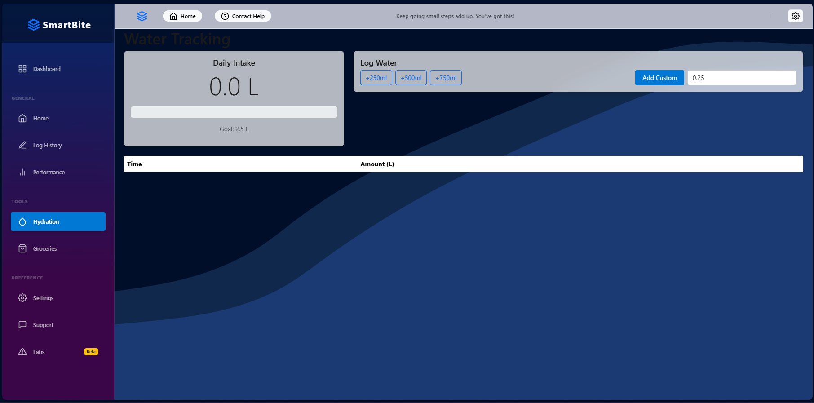
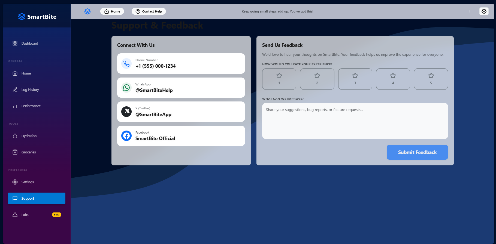
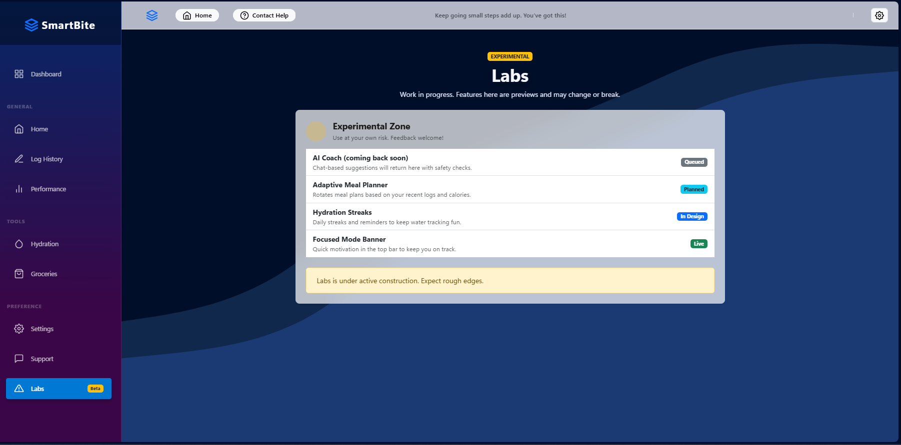

|     |
| --- |
| Name: Ramasundara Dayananda |
| Student Reference Number: 10967199 |

|     |     |
| --- | --- |
| Module Code: **PUSL2021** | Module Name: **Computing Group Project** |     |
| Coursework Title:SmartBite |     |     |
| Deadline Date: **19<sup>th</sup> February 2026** |     | Member of staff responsible for coursework: Mrs.**Dharani Rajasinghe** |
| Programme: Software Engineer |     |     |
| Please note that University Academic Regulations are available under Rules and Regulations on the University website [www.plymouth.ac.uk/studenthandbook](http://www.plymouth.ac.uk/studenthandbook). |     |     |
| Group work: please list all names of all participants formally associated with this work and state whether the work was undertaken alone or as part of a team. Please note you may be required to identify individual responsibility for component parts.<br><br>Abekon Abekon 10967136 Dona Niroshani 10967387<br><br>Bulathge Abeysooriya 10967231 Athukoralge Pabasara 10967388<br><br>Adhikari Adhikari Unknown Rathnayaka Rathnayaka 10967199<br><br>Kurugaha Bandara 10967068 Sathira Edirisinghe 10967141<br><br>Ramasundara Dayananda 10967199 Dunukara Madugalla 10967337<br><br>**_We confirm that we have read and understood the Plymouth University regulations relating to Assessment Offences and that we are aware of the possible penalties for any breach of these regulations. We confirm that this is the independent work of the group._**<br><br>Signed on behalf of the group: |     |     |
| Individual assignment: **_I confirm that I have read and understood the Plymouth University regulations relating to Assessment Offences and that I am aware of the possible penalties for any breach of these regulations. I confirm that this is my own independent work._**<br><br>Signed: |     |     |
| Use of translation software: failure to declare that translation software or a similar writing aid has been used will be treated as an assessment offence.<br><br>I \*have used/not used translation software.<br><br>If used, please state name of software………………………………………………………………… |     |     |
| **Overall mark \___\__% Assessors Initials \___\___ Date_\___\___\__** |     |     |

  

## Table of Contents

- [Chapter 01 — Introduction](#chapter-01--introduction)
    - [1.1 Introduction](#11-introduction)
    - [1.2 Problem Definition](#12-problem-definition)
    - [1.3 Project Objectives](#13-project-objectives)
- [Chapter 02 — System Analysis](#chapter-02--system-analysis)
    - [2.1 Facts Gathering Techniques](#21-facts-gathering-techniques)
    - [2.2 Existing System](#22-existing-system)
    - [2.3 Drawbacks of the Existing System](#23-drawbacks-of-the-existing-system)
- [Chapter 03 — Requirements Specification](#chapter-03--requirements-specification)
    - [3.1 Functional Requirements](#31-functional-requirements)
    - [3.2 Non-Functional Requirements](#32-non-functional-requirements)
    - [3.3 Hardware / Software Requirements](#33-hardware--software-requirements)
- [Chapter 04 — Feasibility Study](#chapter-04--feasibility-study)
    - [4.1 Operational Feasibility](#41-operational-feasibility)
    - [4.2 Technical Feasibility](#42-technical-feasibility)
    - [4.3 Economical Feasibility](#43-economical-feasibility)
- [Chapter 05 — System Architecture](#chapter-05--system-architecture)
    - [5.1 Use Case Diagram](#51-use-case-diagram)
    - [5.2 Class Diagram of Proposed System](#52-class-diagram-of-proposed-system)
    - [5.3 ER Diagram](#53-er-diagram)
    - [5.4 ER Diagram (SQL)](#54-er-diagram-sql)
    - [5.5 High-Level Architectural Diagram](#55-high-level-architectural-diagram)
- [Chapter 06 — Database Design & Normalisation](#chapter-06--database-design--normalisation)
    - [6.1 Schema Overview](#61-schema-overview)
    - [6.2 First Normal Form (1NF)](#62-first-normal-form-1nf)
    - [6.3 Second Normal Form (2NF)](#63-second-normal-form-2nf)
    - [6.4 Third Normal Form (3NF)](#64-third-normal-form-3nf)
    - [6.5 Normalisation Summary](#65-normalisation-summary)
- [Chapter 07 — Development Tools and Technologies](#chapter-07--development-tools-and-technologies)
    - [7.1 Development Methodology](#71-development-methodology)
    - [7.2 Programming Languages and Tools](#72-programming-languages-and-tools)
    - [7.3 Third-Party Components and Libraries](#73-third-party-components-and-libraries)
    - [7.4 Algorithms](#74-algorithms)
- [Chapter 08 — Implementation Progress](#chapter-08--implementation-progress)
    - [8.1 Development Environment Setup](#81-development-environment-setup)
    - [8.2 Implemented Features](#82-implemented-features)
    - [8.3 Screenshots](#83-screenshots)
    - [8.4 Key Code Snippets](#84-key-code-snippets)
    - [8.5 Challenges Encountered and Solutions](#85-challenges-encountered-and-solutions)
    - [8.6 Current System Limitations](#86-current-system-limitations)
- [Chapter 09 — Discussion](#chapter-09--discussion)
    - [9.1 Summary of the Report](#91-summary-of-the-report)
    - [9.2 What Has Changed from the Proposal](#92-what-has-changed-from-the-proposal)
    - [9.3 Future Plans](#93-future-plans)
- [References](#references)
- [Team Plan & Responsibility Matrix](#team-plan--responsibility-matrix)
- [Appendixes](#appendixes)

## List of Figures and Tables

| Figure / Table | Type | Title | Section |
| --- | --- | --- | --- |
| Figure 5.1 | Diagram | Use Case Diagram | 5.1 |
| Figure 5.2 | Diagram | Class Diagram of Proposed System | 5.2 |
| Figure 5.3 | Diagram | ER Diagram | 5.3 |
| Figure 5.4 | Diagram | ER Diagram (SQL) | 5.4 |
| Figure 5.5 | Diagram | High-Level Architectural Diagram | 5.5 |
| Figure 8.1 | Screenshot | Application Startup | 8.3 |
| Figure 8.2 | Screenshot | Dashboard View | 8.3 |
| Figure 8.3 | Screenshot | Home Page | 8.3 |
| Figure 8.4 | Screenshot | Log History | 8.3 |
| Figure 8.5 | Screenshot | Performance Reports | 8.3 |
| Figure 8.6 | Screenshot | Hydration Tracking | 8.3 |
| Figure 8.7 | Screenshot | Groceries / Shopping List | 8.3 |
| Figure 8.8 | Screenshot | Settings — Admin Access | 8.3 |
| Figure 8.9 | Screenshot | Settings — Consumer Blocked | 8.3 |
| Figure 8.10 | Screenshot | Support / Feedback | 8.3 |
| Figure 8.11 | Screenshot | Labs (Beta) | 8.3 |
| Figure 8.12 | Screenshot | Connection / Rejoin Error | 8.3 |
| Figure 8.13 | Screenshot | Role-Based Access Warning | 8.3 |
| Table 3.1 | Table | Functional Requirements | 3.1 |
| Table 3.2 | Table | Non-Functional Requirements | 3.2 |
| Table 3.3 | Table | Software Requirements | 3.3 |
| Table 5.1 | Table | ER Diagram — SQL Column Definitions | 5.4 |
| Table 6.1 | Table | Schema Overview | 6.1 |
| Table 6.2 | Table | 1NF Compliance | 6.2 |
| Table 6.3 | Table | 2NF Compliance | 6.3 |
| Table 6.4 | Table | 3NF Compliance | 6.4 |
| Table 7.1 | Table | Programming Languages and Tools | 7.2 |
| Table 7.2 | Table | Third-Party Components and Libraries | 7.3 |
| Table 8.1 | Table | Implemented Features Status | 8.2 |
| Table 8.2 | Table | Challenges and Solutions | 8.5 |
| Table 9.1 | Table | Team Responsibility Matrix | Team Plan |

---

## Chapter 01 — Introduction

### 1.1 Introduction

SmartBite started as a straightforward idea: instead of juggling three or four different phone apps to keep track of what we eat, how much water we drink, and what groceries we need to buy, why not put everything in one place? That question turned into a full-stack web application built on Blazor Server and .NET 10.

At its heart, SmartBite is a health companion. End users — the people actually logging their meals and filling their water bottles — get a clean dashboard where they can see daily calorie counts, macronutrient breakdowns, water intake history, and a grocery shopping list they can tick off as they go. Administrators, on the other hand, see a different side of the application: they manage user accounts, configure nutritional targets, and oversee the system settings. This split is handled through role-based access control that runs through every layer of the software, from the Razor components in the browser down to the API endpoints on the server.

The solution is structured as a multi-project .NET repository:

- **computer_project.Web** — the Blazor Server front-end. This is where all the pages, layout components, session management, and the HTTP client that talks to the API live.
- **computer_project.ApiService** — the ASP.NET Core back-end. It exposes a set of RESTful minimal API endpoints and handles all database operations through Entity Framework Core with a SQLite database file (`SmartBite.db`).
- **computer_project.ServiceDefaults** — a shared project for cross-cutting service configuration, following .NET Aspire conventions.
- **computer_project.AppHost** — the host entry point that bootstraps the entire solution.

The user interface draws heavy inspiration from the Windows 11 mica and acrylic material design language. Semi-transparent card surfaces, soft blur effects, and a full light/dark theme toggle give SmartBite a modern, polished look that feels closer to a native desktop application than a typical web page.

### 1.2 Problem Definition

People who want to take their nutrition seriously tend to end up with a fragmented workflow. They might use one app for calorie tracking (something like MyFitnessPal), a second app for water reminders (WaterMinder, for example), and then keep a grocery list in a completely separate note-taking app or a scribbled piece of paper. The result is a patchwork of disconnected tools:

- Data sits in silos — there is no single view that shows how today's meals, water intake, and grocery spending relate to each other.
- Manual calculations are error-prone — adding up protein, carbs, and fat by hand or in a spreadsheet is tedious and easy to get wrong.
- There is no concept of roles — families, flatmates, or small teams have no way to separate personal health tracking from shared household management.
- Most existing tools are mobile-only, which means anyone who prefers working on a laptop or a desktop is out of luck.
- Getting data out of these apps is often difficult — few of them offer a simple CSV export.

SmartBite was conceived to address these gaps by bringing meal logging, water tracking, grocery management, and health reporting under a single roof, with role-aware access and data portability baked in from the start.

### 1.3 Project Objectives

The objectives we set out with were deliberately practical:

1. Build a unified web application that handles meal logging, water tracking, grocery list management, and daily health reporting — all within the same interface.
2. Implement proper role-based access control so that consumers and administrators each get functionality appropriate to their role.
3. Deliver a responsive, theme-aware UI that looks and works well on everything from a phone screen to a widescreen monitor.
4. Provide data export capabilities so users can download their health data as CSV files and do whatever they want with it.
5. Use a modular codebase that cleanly separates front-end, back-end, and shared concerns into distinct projects.
6. Persist all data in a SQLite database so nothing is lost when the application restarts.

---

## Chapter 02 — System Analysis

### 2.1 Facts Gathering Techniques

Before writing any code, we spent time understanding what existing tools do well and where they fall short. The following techniques guided our analysis:

- **Observation** — We reviewed popular health tracking applications including MyFitnessPal, Samsung Health, Fitbit, and Apple Health. The goal was not to copy them but to understand common UX patterns: how they lay out dashboards, how they handle data entry, and what kind of feedback they give users after logging a meal or a workout.
- **Questionnaires** — Informal surveys were circulated among team members, friends, and coursemates. The questions focused on what annoys people about their current tracking setup, whether they use multiple apps, and whether they would prefer a web-based tool over a mobile app.
- **Document review** — We looked at nutritional guidelines published by the NHS and the WHO, as well as macro tracking best practices from sports nutrition resources. This helped us decide which data fields were essential (calories, protein, carbs, fat) and which could be deferred (micronutrients, fibre).
- **Prototyping** — Early Blazor prototypes were built to validate layout decisions. We experimented with sidebar placement, card sizes, and colour palettes before committing to the mica/acrylic theme.

### 2.2 Existing System

Before SmartBite, the typical workflow for a health-conscious user looked something like this:

- **Paper-based tracking** — Some people still use notebooks or printed meal plan templates. Calorie calculations are done by hand, which is slow and unreliable.
- **Spreadsheets** — Excel or Google Sheets are a step up from paper, but they require users to build their own formulas for macro summation, and there is no built-in notion of a "meal" or "water intake" — it is all just rows and columns.
- **Multiple mobile apps** — The most common approach: one app for meal tracking, another for hydration, a third for grocery lists. Each app has its own account, its own data format, and its own notification scheme. Nothing talks to anything else.

### 2.3 Drawbacks of the Existing System

| Drawback | Impact |
| --- | --- |
| Data fragmentation across multiple tools | No unified daily health summary; users must mentally combine data from several sources |
| No role-based access | No way to separate personal tracking from admin or household management |
| Manual calculations | Error-prone macro aggregation; easy to miscount calories or forget to log a snack |
| No integrated grocery-to-meal correlation | Shopping lists exist in isolation from nutritional goals |
| Platform dependency | Most tools are mobile-only; no first-class desktop web experience |
| No straightforward export | Difficult to back up, share, or migrate personal health data |

---

## Chapter 03 — Requirements Specification

### 3.1 Functional Requirements

_Table 3.1 — Functional Requirements_

| ID | Requirement | Priority |
| --- | --- | --- |
| FR-01 | Users shall be able to register and log in with a username and password | High |
| FR-02 | Users shall be able to log meals with name, calories, protein, carbs, and fat | High |
| FR-03 | Users shall be able to view meal history sorted by date | High |
| FR-04 | Users shall be able to log water intake amounts | High |
| FR-05 | Users shall be able to view a dashboard with daily macro summary cards | High |
| FR-06 | Users shall be able to export health reports as CSV files | Medium |
| FR-07 | Users shall be able to add, delete, and mark grocery items as purchased | High |
| FR-08 | Users shall be able to assign payment methods to grocery items | Medium |
| FR-09 | The system shall simulate a checkout/delivery tracker for grocery orders | Low |
| FR-10 | Admins shall be able to view and manage all registered users | High |
| FR-11 | Admins shall have exclusive access to the Settings page | High |
| FR-12 | Consumers shall be blocked from accessing admin-only pages | High |
| FR-13 | Users shall be able to toggle between light and dark themes | Medium |
| FR-14 | Users shall be able to submit feedback via a contact/support page | Medium |
| FR-15 | The system shall display a macro aggregation report (total calories, protein, carbs, fat) | High |

### 3.2 Non-Functional Requirements

_Table 3.2 — Non-Functional Requirements_

| ID | Requirement | Category |
| --- | --- | --- |
| NFR-01 | The UI shall be responsive and usable on screens from 320 px to 1920 px+ | Usability |
| NFR-02 | Page navigation shall feel instant through the Blazor Server SignalR connection | Performance |
| NFR-03 | The application shall follow a consistent mica/acrylic visual theme | Usability |
| NFR-04 | The system shall handle SignalR disconnections gracefully with a reload prompt | Reliability |
| NFR-05 | Role-based access shall be enforced at the component rendering level | Security |
| NFR-06 | The codebase shall be organised into separate projects for UI, API, and shared defaults | Maintainability |
| NFR-07 | Data shall persist across application restarts using SQLite | Reliability |
| NFR-08 | The system shall seed demo data on startup so it is usable without manual setup | Usability |

### 3.3 Hardware / Software Requirements

_Table 3.3 — Software Requirements_

| Component | Requirement |
| --- | --- |
| Runtime | .NET 10 SDK (mandatory) |
| IDE | Visual Studio 2026 Insiders (recommended) or any editor with the .NET CLI |
| OS | Windows 10/11, macOS, or Linux — any OS that supports .NET 10 |
| Browser | Any modern browser: Chrome, Edge, Firefox, Safari |
| Database | SQLite (bundled — no separate installation needed) |
| Source control | Git 2.x+ |
| Network | Internet connection for initial NuGet package restore; SignalR requires an active connection during use |

**Hardware (minimum):**
- 4 GB RAM
- 2 GHz dual-core processor
- 2 GB free disk space

---

## Chapter 04 — Feasibility Study

### 4.1 Operational Feasibility

The people who would use SmartBite — students, gym-goers, anyone counting calories — are already comfortable with web applications and responsive dashboards. Nothing in SmartBite's interface asks users to learn a new paradigm. The sidebar is a sidebar, the cards are cards, and the forms are forms. The role separation (admin versus consumer) maps to an intuitive real-world split: one person manages the system, everyone else uses it for personal tracking.

The decision to seed demo data on every fresh database was deliberate. It means that anyone who downloads the project and runs it can immediately see how the application behaves without having to register, log in, and manually create sample data first. For evaluation and demonstration purposes, this makes a meaningful difference.

### 4.2 Technical Feasibility

The technology choices were driven by what the team already knew and what the project timeline allowed. .NET 10 with Blazor Server is a mature stack — the documentation is comprehensive, the tooling (Visual Studio, dotnet CLI, hot reload) is solid, and the community is large enough that most problems have already been solved by someone on Stack Overflow or the official GitHub issues.

For data persistence, we chose SQLite through the `Microsoft.EntityFrameworkCore.Sqlite` NuGet package (version 10.0.3). SQLite stores the entire database in a single file — `SmartBite.db` — which sits in the project output directory. There is no separate database server to install, no connection string pointing to a remote host, and no configuration ceremony. When the application starts, Entity Framework Core creates the file if it does not exist and applies the schema automatically. If, in the future, we need to move to SQL Server or PostgreSQL, the change is limited to swapping the provider in `Program.cs` and updating the connection string — the rest of the codebase, including all LINQ queries and model definitions, stays the same.

JavaScript interop through `IJSRuntime` fills the gaps where Blazor Server cannot operate on the browser directly. Theme persistence (writing the `data-bs-theme` attribute to the HTML element) and file downloads (triggering a browser save dialog from a generated CSV string) are the two main areas where we rely on small JS helper functions.

### 4.3 Economical Feasibility

Every tool in the stack is free and open-source. The .NET 10 SDK, Bootstrap 5, Entity Framework Core, SQLite, and Bootstrap Icons cost nothing to use. There is no paid cloud dependency during development — the application runs entirely on localhost. Google Gemini API was explored for AI-powered nutrition estimates; the free tier would have been sufficient for a demo, but the integration did not work as expected so no cost was incurred. The total development budget is limited to the team's time.

---

## Chapter 05 — System Architecture

### 5.1 Use Case Diagram

_Figure 5.1 — Use Case Diagram_


The use case diagram captures the two primary actors — **Consumer** and **Admin** — and the actions available to each. Consumers can log meals, track water, manage groceries, view the dashboard, export CSV reports, and submit feedback. Admins can manage users, configure nutritional goals, and access the dashboard. Both actors share access to the dashboard, but consumers are blocked from the Settings page and admins see a warning when they try to access consumer-only features.

### 5.2 Class Diagram of Proposed System

_Figure 5.2 — Class Diagram_


The system's domain model consists of seven entity classes:

- **User** — stores account credentials and role (Admin or EndUser).
- **Meal** — a single logged meal entry with calorie and macro data, linked to a User.
- **WaterIntake** — a water consumption entry with amount and timestamp, linked to a User.
- **ShoppingListItem** — a grocery item with quantity, purchase status, and payment method, linked to a User.
- **HealthReport** — an aggregated nutrition summary for a given day, linked to a User.
- **UserGoal** — per-user targets for calories, protein, carbs, fat, and water, along with preferences like timezone, region, and dark mode, linked to a User.
- **AIRecommendation** — a standalone entity for AI-suggested meals (reserved for future integration).

Relationships: a User can log many Meals, record many WaterIntakes, manage many ShoppingListItems, generate many HealthReports, and set exactly one UserGoal.

### 5.3 ER Diagram

_Figure 5.3 — Entity-Relationship Diagram_


The ER diagram shows the same relationships described in the class diagram but from a database perspective. Each entity maps to a table, each property maps to a column, and the `UserId` foreign key connects child tables (Meals, WaterIntakes, ShoppingListItems, HealthReports, UserGoals) back to the Users table. AIRecommendations is a standalone table with no foreign key — it exists in the schema in preparation for AI features that will be connected to users in a future iteration.

### 5.4 ER Diagram (SQL)

_Figure 5.4 — ER Diagram (SQL) with column types_


The SQL-level ER diagram adds data type annotations to every column. Below is a tabular summary of each table's columns, types, and constraints as they exist in the SQLite schema:

_Table 5.1 — SQL Column Definitions_

**Users**

| Column | Type | Constraint |
| --- | --- | --- |
| Id | INTEGER | PRIMARY KEY, AUTOINCREMENT |
| Username | TEXT | NOT NULL |
| PasswordHash | TEXT | NOT NULL |
| Role | TEXT | NOT NULL, DEFAULT 'EndUser' |

**Meals**

| Column | Type | Constraint |
| --- | --- | --- |
| Id | INTEGER | PRIMARY KEY, AUTOINCREMENT |
| UserId | INTEGER | FOREIGN KEY → Users.Id |
| Name | TEXT | NOT NULL |
| Calories | REAL | — |
| Protein | REAL | — |
| Carbs | REAL | — |
| Fat | REAL | — |
| LoggedAt | TEXT (ISO 8601) | — |

**WaterIntakes**

| Column | Type | Constraint |
| --- | --- | --- |
| Id | INTEGER | PRIMARY KEY, AUTOINCREMENT |
| UserId | INTEGER | FOREIGN KEY → Users.Id |
| Amount | REAL | — |
| LoggedAt | TEXT (ISO 8601) | — |

**ShoppingListItems**

| Column | Type | Constraint |
| --- | --- | --- |
| Id | INTEGER | PRIMARY KEY, AUTOINCREMENT |
| UserId | INTEGER | FOREIGN KEY → Users.Id |
| ItemName | TEXT | NOT NULL |
| Quantity | TEXT | NULLABLE |
| IsPurchased | INTEGER (0/1) | — |
| PaymentMethod | TEXT | DEFAULT 'Cash' |

**HealthReports**

| Column | Type | Constraint |
| --- | --- | --- |
| Id | INTEGER | PRIMARY KEY, AUTOINCREMENT |
| UserId | INTEGER | FOREIGN KEY → Users.Id |
| TotalCalories | REAL | — |
| MealCount | INTEGER | — |
| Protein | REAL | — |
| Carbs | REAL | — |
| Fat | REAL | — |
| Summary | TEXT | — |
| GeneratedAt | TEXT (ISO 8601) | — |

**UserGoals**

| Column | Type | Constraint |
| --- | --- | --- |
| Id | INTEGER | PRIMARY KEY, AUTOINCREMENT |
| UserId | INTEGER | FOREIGN KEY → Users.Id |
| TargetCalories | REAL | — |
| TargetProtein | REAL | — |
| TargetCarbs | REAL | — |
| TargetFat | REAL | — |
| TargetWater | REAL | — |
| TimeZoneId | TEXT | DEFAULT 'UTC' |
| Region | TEXT | DEFAULT 'Global' |
| IsDarkMode | INTEGER (0/1) | DEFAULT 0 |

**AIRecommendations**

| Column | Type | Constraint |
| --- | --- | --- |
| Id | INTEGER | PRIMARY KEY, AUTOINCREMENT |
| SuggestedMeal | TEXT | NOT NULL |
| Reason | TEXT | NOT NULL |
| EstimatedCalories | INTEGER | — |

### 5.5 High-Level Architectural Diagram

_Figure 5.5 — High-Level Architecture_


The architecture follows a two-tier client-server pattern:

1. **Browser tier** — Blazor Server renders all UI components on the server and pushes DOM updates to the browser over a persistent SignalR WebSocket connection. The browser runs minimal JavaScript; the bulk of the application logic (routing, state management, event handling) executes server-side in C#.
2. **API tier** — The Blazor front-end does not talk to the database directly. Instead, it uses `SmartBiteApiClient` (a typed `HttpClient` wrapper) to call the ASP.NET Core Minimal API endpoints exposed by the `computer_project.ApiService` project. Those endpoints interact with the SQLite database through Entity Framework Core's `AppDbContext`.

```
┌─────────────────────────────────────────────────┐
│                   Browser                       │
│  ┌───────────────────────────────────────────┐  │
│  │  Blazor Server (SignalR)                  │  │
│  │  MainLayout · NavMenu · Pages             │  │
│  │  UserSession · IJSRuntime interop         │  │
│  └────────────────┬──────────────────────────┘  │
└───────────────────┼─────────────────────────────┘
                    │ HTTP (SmartBiteApiClient)
┌───────────────────┼─────────────────────────────┐
│  computer_project.ApiService                    │
│  ┌────────────────┴──────────────────────────┐  │
│  │  ASP.NET Core Minimal APIs                │  │
│  │  /meals · /water · /shoppinglist          │  │
│  │  /stats · /goals · /users                 │  │
│  └────────────────┬──────────────────────────┘  │
│                   │                             │
│  ┌────────────────┴──────────────────────────┐  │
│  │  EF Core + SQLite (SmartBite.db)          │  │
│  │  AppDbContext                             │  │
│  └───────────────────────────────────────────┘  │
└─────────────────────────────────────────────────┘
```

---

## Chapter 06 — Database Design & Normalisation

### 6.1 Schema Overview

SmartBite persists all application data in a SQLite database file called `SmartBite.db`. Entity Framework Core manages the schema through the `AppDbContext` class, which declares seven `DbSet` properties — one for each table. On first launch, the application checks whether the database is empty and, if so, inserts seed data (demo users, sample meals, water entries, shopping items, and nutritional goals) so the system is immediately usable.

The SQLite provider is registered in `Program.cs` with a single line:

```csharp
builder.Services.AddDbContext<AppDbContext>(options =>
    options.UseSqlite("Data Source=SmartBite.db"));
```

_Table 6.1 — Schema Overview_

| Table | Primary Key | Foreign Key | Description |
| --- | --- | --- | --- |
| Users | Id | — | Registered accounts with role (Admin or EndUser) |
| Meals | Id | UserId → Users.Id | Logged meal entries with calorie and macro data |
| WaterIntakes | Id | UserId → Users.Id | Individual water consumption entries |
| ShoppingListItems | Id | UserId → Users.Id | Grocery items with purchase status and payment method |
| HealthReports | Id | UserId → Users.Id | Aggregated daily nutrition summaries |
| UserGoals | Id | UserId → Users.Id | Per-user targets for calories, macros, water, and preferences |
| AIRecommendations | Id | — | AI-suggested meals (standalone; reserved for future use) |

### 6.2 First Normal Form (1NF)

A table satisfies 1NF when every column holds a single, atomic value, each row is uniquely identifiable through a primary key, and there are no repeating groups or nested arrays. All seven tables in the SmartBite schema meet these conditions. Every column stores one piece of data (a single string, a single number, a single boolean flag), every row has a unique auto-incremented `Id`, and no column contains comma-separated lists or embedded objects.

_Table 6.2 — 1NF Compliance_

| Table | PK | Atomic Columns | Repeating Groups? |
| --- | --- | --- | --- |
| Users | Id | Username, PasswordHash, Role | None |
| Meals | Id | UserId, Name, Calories, Protein, Carbs, Fat, LoggedAt | None |
| WaterIntakes | Id | UserId, Amount, LoggedAt | None |
| ShoppingListItems | Id | UserId, ItemName, Quantity, IsPurchased, PaymentMethod | None |
| HealthReports | Id | UserId, TotalCalories, MealCount, Protein, Carbs, Fat, Summary, GeneratedAt | None |
| UserGoals | Id | UserId, TargetCalories, TargetProtein, TargetCarbs, TargetFat, TargetWater, TimeZoneId, Region, IsDarkMode | None |
| AIRecommendations | Id | SuggestedMeal, Reason, EstimatedCalories | None |

### 6.3 Second Normal Form (2NF)

A table satisfies 2NF when it is already in 1NF and every non-key column depends on the entire primary key — not just part of it. Partial dependencies only arise when a table has a composite primary key (a key made up of two or more columns). Since every table in SmartBite uses a single auto-incremented column (`Id`) as its primary key, partial dependencies are structurally impossible. Every non-key column depends on the whole key by definition.

_Table 6.3 — 2NF Compliance_

| Table | PK | Non-Key Columns | Partial Dependency? |
| --- | --- | --- | --- |
| Users | Id | Username, PasswordHash, Role | No — single-column PK |
| Meals | Id | UserId, Name, Calories, Protein, Carbs, Fat, LoggedAt | No — single-column PK |
| WaterIntakes | Id | UserId, Amount, LoggedAt | No — single-column PK |
| ShoppingListItems | Id | UserId, ItemName, Quantity, IsPurchased, PaymentMethod | No — single-column PK |
| HealthReports | Id | UserId, TotalCalories, MealCount, Protein, Carbs, Fat, Summary, GeneratedAt | No — single-column PK |
| UserGoals | Id | UserId, TargetCalories, TargetProtein, TargetCarbs, TargetFat, TargetWater, TimeZoneId, Region, IsDarkMode | No — single-column PK |
| AIRecommendations | Id | SuggestedMeal, Reason, EstimatedCalories | No — single-column PK |

### 6.4 Third Normal Form (3NF)

A table satisfies 3NF when it is already in 2NF and no non-key column depends on another non-key column — in other words, there are no transitive dependencies. In the SmartBite schema, every non-key column depends directly on the primary key of its own table and on nothing else. The `UserId` columns are foreign keys that reference `Users.Id`, but they do not determine other columns within the same table. For instance, knowing the `UserId` on a Meal row tells you which user logged it, but it does not determine the meal's name or calorie count — those depend only on `Meals.Id`.

_Table 6.4 — 3NF Compliance_

| Table | Transitive Dependency? | Notes |
| --- | --- | --- |
| Users | None | `Role` is a direct attribute of the user, not derived from another column |
| Meals | None | `UserId` is an FK; Name, Calories, Protein, Carbs, Fat, LoggedAt all depend only on `Meals.Id` |
| WaterIntakes | None | `Amount` and `LoggedAt` depend only on `WaterIntakes.Id` |
| ShoppingListItems | None | `ItemName`, `Quantity`, `IsPurchased`, `PaymentMethod` depend only on `ShoppingListItems.Id` |
| HealthReports | None | All aggregation fields depend only on `HealthReports.Id` |
| UserGoals | None | All target and preference fields depend only on `UserGoals.Id` |
| AIRecommendations | None | Standalone table with no FK — no transitive path exists |

### 6.5 Normalisation Summary

The SmartBite database satisfies First, Second, and Third Normal Forms:

- **1NF** — Every value is atomic, every row is uniquely identified, and there are no repeating groups.
- **2NF** — Single-column surrogate primary keys eliminate any possibility of partial dependencies.
- **3NF** — No non-key column transitively depends on the primary key through another non-key column.

The schema was designed this way intentionally. By keeping each table focused on a single entity and linking them through foreign keys, we avoid data redundancy and the update anomalies that come with it. At the same time, the schema remains simple enough that it does not introduce unnecessary join complexity for a health-tracking application of this scale.

---

## Chapter 07 — Development Tools and Technologies

### 7.1 Development Methodology

We followed an **iterative and incremental** approach. Each feature was developed as a vertical slice — meaning that for every new capability (say, water tracking), we built the model, the API endpoint, the client method, and the UI component in a single pass before moving on to the next feature. This kept the application in a working state at all times; at any point during development, we could run the project and demonstrate something functional.

Source control was managed through Git on GitHub. We worked primarily on the `master` branch with feature-based commits. Peer review happened informally — team members would check each other's changes before merging, though we did not use a formal pull request workflow for every commit. The SQLite database made iteration fast because there was no migration server to manage and no remote database to keep in sync; the `SmartBite.db` file could be deleted and recreated from seed data in seconds.

### 7.2 Programming Languages and Tools

_Table 7.1 — Programming Languages and Tools_

| Tool / Language | Purpose |
| --- | --- |
| C# 14 / .NET 10 | Backend API logic and Blazor UI component code |
| Razor (`.razor`) | Component markup, templating, and server-side rendering |
| HTML / CSS | Layout structure, styling, mica/acrylic visual effects |
| JavaScript | Theme toggle (`setTheme`) and CSV file download via `IJSRuntime` |
| PowerShell / dotnet CLI | Build (`dotnet restore`), run (`dotnet run`), hot reload (`dotnet watch`) |
| Visual Studio 2026 Insiders | Primary integrated development environment |
| Git + GitHub | Version control, collaboration, and repository hosting |

### 7.3 Third-Party Components and Libraries

_Table 7.2 — Third-Party Components and Libraries_

| Library | Version | Role |
| --- | --- | --- |
| Bootstrap 5 | 5.x (CDN) | Responsive grid system, buttons, cards, dropdowns, modals |
| Bootstrap Icons | 1.x (CDN) | SVG icon set (`bi bi-*`) used across all UI components |
| Entity Framework Core | 10.0.x | ORM and data access layer |
| Microsoft.EntityFrameworkCore.Sqlite | 10.0.3 | SQLite database provider for EF Core |
| .NET Aspire (ServiceDefaults) | — | Shared service wiring, default configurations, and health checks |

### 7.4 Algorithms

The following logic patterns and algorithms are used in the system:

1. **Macro aggregation** — When the `/stats` endpoint is called, a server-side LINQ query sums calories, protein, carbs, and fat across all meals logged by the user. The result is returned as a `HealthReport` object that the dashboard displays in summary cards. This runs on every request rather than being pre-computed, which keeps the implementation simple at the cost of some performance overhead that is negligible at the current data volumes.

2. **Checkout tracker simulation** — The shopping list page includes a mock delivery tracker that progresses through ten stages with timed delays (`Task.Delay`). At each stage, a status log message is injected into the UI, a progress percentage is updated, and on completion, all unpurchased items are automatically marked as purchased through individual API calls. This was added as an enhancement to demonstrate client-side state progression in Blazor.

3. **Role-based rendering** — The `UserSession` service exposes `IsAdmin` and `IsEndUser` boolean properties derived from `CurrentUser.Role`. Razor components use `@if` directives to conditionally render entire blocks of UI. The `<ConsumerOnly>` wrapper component centralises this pattern: if the current user is an admin, it shows a redirect message instead of the child content.

4. **CSV export** — A `StringBuilder` constructs CSV content row by row from meal data and report summaries. The resulting string is passed to a JavaScript helper function via `IJSRuntime` that creates a Blob, generates a download URL, and triggers the browser's save dialog. This approach avoids server-side file I/O entirely.

---

## Chapter 08 — Implementation Progress

### 8.1 Development Environment Setup

Getting the project running locally requires five steps:

1. **Install .NET 10 SDK** — this is mandatory; earlier SDK versions will not build the solution.
2. **Clone the repository**:
   ```
   git clone https://github.com/ZeroTrace0245/computer_project.git
   cd computer_project
   ```
3. **Restore NuGet packages**:
   ```
   dotnet restore
   ```
4. **Run the API project**:
   ```
   dotnet run --project computer_project.ApiService
   ```
5. **Run the Blazor UI** (with hot reload for development):
   ```
   dotnet watch --project computer_project.Web
   ```

On the first launch, the application creates `SmartBite.db` in the API project's output directory and seeds it with demo users, sample meals, water intakes, shopping items, and default nutritional goals.

### 8.2 Implemented Features

_Table 8.1 — Implemented Features Status_

| Feature | Status | Details |
| --- | --- | --- |
| User registration and login | ✅ Done | Simple credential flow (demo — no password hashing) |
| Meal logging | ✅ Done | Add meals with name, calories, protein, carbs, fat; view history |
| Dashboard and reports | ✅ Done | Daily macro summary cards, health tips, CSV export |
| Water tracking | ✅ Done | Log water intake amounts, view intake history |
| Shopping list | ✅ Done | Add/delete items, payment method tagging, toggle purchased state |
| Checkout tracker | ✅ Done | Simulated delivery progress with live status logs |
| Role-based access control | ✅ Done | Admin-only Settings page; consumers blocked via `<ConsumerOnly>` |
| Light/dark theme | ✅ Done | JS interop toggle with mica/acrylic visual effects |
| Feedback / support page | ✅ Done | Contact channels (phone, WhatsApp, X, Facebook) and rating form |
| Responsive layout | ✅ Done | Collapsible sidebar on mobile, sticky header, adaptive grid |

### 8.3 Screenshots

_Figure 8.1 — Application Startup_


_Figure 8.2 — Dashboard View_


_Figure 8.3 — Home Page_


_Figure 8.4 — Log History_


_Figure 8.5 — Performance Reports_



_Figure 8.6 — Hydration Tracking_



_Figure 8.7 — Groceries / Shopping List_


_Figure 8.8 — Settings (Admin Access)_


_Figure 8.9 — Settings (Consumer Blocked)_


_Figure 8.10 — Support / Feedback_



_Figure 8.11 — Labs (Beta)_



_Figure 8.12 — Connection / Rejoin Error_


_Figure 8.13 — Role-Based Access Warning_


### 8.4 Key Code Snippets

**SQLite database registration** (`Program.cs`):

```csharp
builder.Services.AddDbContext<AppDbContext>(options =>
    options.UseSqlite("Data Source=SmartBite.db"));
```

**Role-based gate component** (`ConsumerOnly.razor`):

```razor
@if (Session.IsAdmin)
{
    <div class="container py-5 text-center">
        <h2 class="fw-bold">Consumer Access Only</h2>
        <p>This feature is designed for consumers.</p>
        <a href="settings" class="btn btn-primary">User & System Management</a>
    </div>
}
else
{
    @ChildContent
}

@code {
    [Parameter] public RenderFragment? ChildContent { get; set; }
}
```

**Session state management** (`UserSession.cs`):

```csharp
public class UserSession
{
    public User? CurrentUser { get; private set; }
    public bool IsLoggedIn => CurrentUser != null;
    public bool IsAdmin => CurrentUser?.Role == "Admin";
    public bool IsEndUser => CurrentUser?.Role == "EndUser";

    public event Action? OnChange;

    public void Login(User user) { CurrentUser = user; NotifyStateChanged(); }
    public void Logout() { CurrentUser = null; NotifyStateChanged(); }
    public void NotifyStateChanged() => OnChange?.Invoke();
}
```

**CSV export** (`Reports.razor`):

```csharp
private async Task ExtractCSV()
{
    var csv = new StringBuilder();
    csv.AppendLine("Type,Name,Calories,Protein,Carbs,Fat,Date");
    csv.AppendLine($"Summary,Daily Total,{report.TotalCalories},...");
    foreach (var meal in meals)
    {
        csv.AppendLine($"Meal,{meal.Name},{meal.Calories},...");
    }
    await JS.InvokeVoidAsync("downloadFile", filename, csv.ToString());
}
```

**Meal logging endpoint** (`Program.cs`):

```csharp
app.MapPost("/meals", async (Meal meal, AppDbContext db) =>
{
    db.Meals.Add(meal);
    await db.SaveChangesAsync();
    return Results.Ok(meal);
});
```

### 8.5 Challenges Encountered and Solutions

_Table 8.2 — Challenges and Solutions_

| # | Challenge | Solution |
| --- | --- | --- |
| 1 | Blazor Server drops the SignalR connection when the browser goes idle or the network is interrupted briefly | We added a reconnection error UI (`blazor-error-ui` div) at the bottom of the layout with a clear reload prompt so users know what happened and what to do about it |
| 2 | Google Gemini AI API key integration was attempted but the API did not return usable results | We kept the `AIService` class in the codebase for future re-enablement but moved all AI-dependent features (nutrition estimates, meal recommendations, chat) to the future plans section |
| 3 | Role-based access checks were duplicated across multiple pages, making them hard to maintain | We centralised the role logic into `UserSession` (`IsAdmin` and `IsEndUser` properties) and built a reusable `<ConsumerOnly>` wrapper component that any page can use without re-implementing the check |
| 4 | The user's theme selection was not persisting across page navigations | We ensured that `ApplyTheme()` is called via `OnAfterRenderAsync` on the first render, and the JS interop function writes the `data-bs-theme` attribute directly to the `<html>` element |
| 5 | First-run database setup needed to be automatic | Seed data logic in `Program.cs` checks if the SQLite database is empty on startup and inserts demo users, meals, water entries, shopping items, and nutritional goals so the application is always usable after a fresh launch |

### 8.6 Current System Limitations

1. **No real authentication** — Passwords are stored and compared as plain text. There is no hashing, no token-based authentication, and no cookie-based session management. This is acceptable for a prototype but would need to be replaced with ASP.NET Core Identity or a similar framework before any real-world deployment.
2. **Single-user demo scope** — Most API endpoints default to `UserId = 1`. There is no multi-user session isolation, which means that if two people were using the application simultaneously, they would see and modify the same data.
3. **No automated tests** — The solution does not contain any unit test or integration test projects. Test coverage is zero, and all verification has been done manually.
4. **No AI features** — The Google Gemini API key was configured and the service class was implemented, but the integration did not produce usable results. AI-powered nutrition estimates and personalised meal recommendations are not functional in this iteration.
5. **No offline support** — Blazor Server requires a persistent SignalR WebSocket connection. If the connection drops, the UI becomes unresponsive until it reconnects. There is no service worker, PWA manifest, or offline fallback page.

---

## Chapter 09 — Discussion

### 9.1 Summary of the Report

This report has documented the development of SmartBite, a Blazor Server web application that brings meal logging, water tracking, grocery management, and health reporting together in a single role-aware platform. We have covered the problem that motivated the project, the requirements we gathered, the feasibility analysis that justified our technology choices, the system architecture, the database design with normalisation analysis, the tools and libraries we used, and the current state of the implementation.

The core of the system is working. Users can register, log in, record meals with full macro breakdowns, track water consumption, manage a grocery shopping list with payment tagging, view an aggregated daily dashboard, and export their data as CSV files. Administrators have a separate view for managing user accounts and configuring nutritional goals. The interface adapts to both light and dark themes and is responsive across screen sizes.

Data persistence is handled by SQLite through Entity Framework Core. The `SmartBite.db` file stores all application data and survives restarts, which was one of the explicit project objectives. The database schema is normalised to third normal form, as detailed in Chapter 06.

### 9.2 What Has Changed from the Proposal

Three significant things changed between the initial proposal and what was actually delivered:

- **AI integration was planned but not delivered.** The original proposal included Google Gemini API integration for AI-powered nutrition estimates and meal recommendations. The API key was obtained, the `AIService` class was written, but the integration did not function correctly during development. Rather than shipping broken AI features, we deferred them to future work.
- **SQLite replaced the originally planned SQL Server.** The proposal targeted SQL Server for persistent storage, but we opted for SQLite during development because it requires no separate server installation and the single-file database model dramatically simplified the development workflow. The Entity Framework Core abstraction means that migrating to SQL Server or PostgreSQL in the future requires only a connection string change.
- **The checkout tracker was an unplanned addition.** A simulated grocery order delivery tracker was built as an enhancement that was not in the original proposal. It adds a richer experience to the shopping list page and demonstrates client-side state progression in Blazor.

### 9.3 Future Plans

Looking ahead, the following work items are prioritised for the next iteration:

1. **AI integration** — Re-enable Google Gemini API for meal nutrition estimates, personalised recommendations, and hydration advice. The service infrastructure already exists in the codebase.
2. **Production database** — Evaluate migrating from SQLite to SQL Server or PostgreSQL for improved concurrency and scalability in multi-user scenarios.
3. **Real authentication** — Replace the current plain-text password flow with ASP.NET Core Identity, including password hashing and token or cookie-based session management.
4. **Multi-user isolation** — Scope all data queries to the authenticated user's ID so that each person only sees their own meals, water intakes, and shopping list.
5. **Automated testing** — Add xUnit test projects covering at least the API endpoints and the session management logic.
6. **Trend charts** — Integrate a JavaScript charting library (or Blazor-native equivalent) to display weekly and monthly trends for calories, macros, and water intake.
7. **PDF and Excel export** — Extend the export functionality beyond CSV to include PDF reports and Excel spreadsheets.
8. **Push notifications** — Implement browser notifications for hydration reminders and meal logging prompts.
9. **PWA / offline support** — Add a service worker and PWA manifest so the application can at least display a cached dashboard when offline.

---

## References

1. Microsoft. (2025). *ASP.NET Core Blazor overview*. Microsoft Learn. Available at: https://learn.microsoft.com/en-us/aspnet/core/blazor/ (Accessed: 10 January 2026).
2. Microsoft. (2025). *Entity Framework Core — SQLite database provider*. Microsoft Learn. Available at: https://learn.microsoft.com/en-us/ef/core/providers/sqlite/ (Accessed: 10 January 2026).
3. Microsoft. (2025). *ASP.NET Core Minimal APIs overview*. Microsoft Learn. Available at: https://learn.microsoft.com/en-us/aspnet/core/fundamentals/minimal-apis (Accessed: 10 January 2026).
4. Microsoft. (2025). *.NET Aspire overview*. Microsoft Learn. Available at: https://learn.microsoft.com/en-us/dotnet/aspire/ (Accessed: 12 January 2026).
5. Bootstrap. (2024). *Bootstrap 5 documentation*. Available at: https://getbootstrap.com/docs/5.3/ (Accessed: 12 January 2026).
6. Bootstrap Icons. (2024). *Icon library*. Available at: https://icons.getbootstrap.com/ (Accessed: 12 January 2026).
7. SQLite Consortium. (2024). *About SQLite*. Available at: https://sqlite.org/about.html (Accessed: 15 January 2026).
8. Google. (2025). *Gemini API documentation*. Available at: https://ai.google.dev/docs (Accessed: 15 January 2026).
9. Codd, E.F. (1970). 'A relational model of data for large shared data banks', *Communications of the ACM*, 13(6), pp. 377–387. doi: 10.1145/362384.362685.
10. Connolly, T. and Begg, C. (2015). *Database Systems: A Practical Approach to Design, Implementation, and Management*. 6th edn. Harlow: Pearson Education.
11. Microsoft. (2025). *SignalR introduction*. Microsoft Learn. Available at: https://learn.microsoft.com/en-us/aspnet/core/signalr/introduction (Accessed: 18 January 2026).
12. Date, C.J. (2004). *An Introduction to Database Systems*. 8th edn. Boston: Addison-Wesley.
13. NHS. (2024). *Eat well — NHS*. Available at: https://www.nhs.uk/live-well/eat-well/ (Accessed: 5 January 2026).
14. World Health Organization. (2024). *Healthy diet — Fact sheet*. Available at: https://www.who.int/news-room/fact-sheets/detail/healthy-diet (Accessed: 5 January 2026).

---

## Team Plan & Responsibility Matrix

_Table 9.1 — Team Responsibility Matrix_

| # | Area | Primary Files | Index No. | Owner |
| --- | --- | --- | --- | --- |
| 1 | Layout & responsiveness | MainLayout.razor, MainLayout.razor.css, app.css | 10967337 | [DGJKM Madugalla](https://github.com/kaveeshajanith10-afk) |
| 2 | Theming pipeline | MainLayout.razor, app.css, UserSession.cs | 10967141 | [Sathira lakshan](https://github.com/Sathi-26) |
| 3 | Navigation & routing | NavMenu.razor, NavMenu.razor.css, app.css | 10967134 | [Rhls.dayananda](https://github.com/Lalindu01) |
| 4 | Session state | UserSession.cs, MainLayout.razor | 10967068 | [KGSN Bandara](https://github.com/sahannirmal1511) |
| 5 | Auth flows | Login.razor, Register.razor, Settings.razor, ConsumerOnly.razor | 10967388 | [Athukoralage Pabasara](https://github.com/MashiAshi) |
| 6 | Header actions | MainLayout.razor (quick actions), SmartBiteApiClient.cs | 10967136 | Abekon Abekon |
| 7 | Profile chip | MainLayout.razor (profile section), UserSession.cs | 10967387 | [D.M.Nisansala Niroshani](https://github.com/NisansalaDMN) |
| 8 | Feedback / contact | Feedback.razor, SmartBiteApiClient.cs, Program.cs, Models.cs | 10967231 | [BSB ABEYSOORIYA](https://github.com/sithiraabey) |
| 9 | API client & database | SmartBiteApiClient.cs, Models.cs, Program.cs, AppDbContext.cs | 10967199 | [Sachitha Rathnayaka](https://github.com/ZeroTrace0245/SmartBit.git) |
| 10 | Database design & SQL | AppDbContext.cs, Models.cs, Program.cs (SQLite config + seed data) | 10967175 | AMGG ADHIKARI |

---

## Appendixes

### Appendix A — File Structure

```
computer_project.Web/                  # Blazor Server UI
  Components/
    Layout/
      MainLayout.razor                 — Shell layout (sidebar, header, content)
      NavMenu.razor                    — Sidebar navigation links
    Pages/
      Home.razor                       — Landing page
      Dashboard.razor                  — Daily summary cards
      Feedback.razor                   — Contact / help page
      Settings.razor                   — Admin panel (users, goals)
      ShoppingList.razor               — Grocery management
      MealLogging.razor                — Meal logging + history
      WaterTracking.razor              — Hydration tracking
      Reports.razor                    — Detailed reports + CSV export
      Labs.razor                       — Experimental / beta features
      Login.razor                      — Login page
      Register.razor                   — Registration page
  Services/
    UserSession.cs                     — Session state management
  SmartBiteApiClient.cs                — Typed HttpClient wrapper for API
  Models.cs                            — Client-side DTOs
  wwwroot/
    app.css                            — Theme CSS (mica/acrylic)

computer_project.ApiService/           # Backend API
  Program.cs                           — Minimal API endpoints + SQLite config + seed data
  Models.cs                            — Entity classes (User, Meal, WaterIntake, etc.)
  Data/
    AppDbContext.cs                     — EF Core DbContext (7 DbSets)
  Services/
    AIService.cs                       — Google Gemini integration (future use)

computer_project.ServiceDefaults/      # Shared service wiring
  Extensions.cs

computer_project.AppHost/              # Host / bootstrap
  Program.cs
```

### Appendix B — Repository

- **GitHub**: [https://github.com/ZeroTrace0245/computer_project](https://github.com/ZeroTrace0245/computer_project)
- **Branch**: master

### Appendix C — Database File

- **File**: `SmartBite.db` (SQLite, created automatically by EF Core on first run)
- **Location**: `computer_project.ApiService/bin/Debug/net10.0/SmartBite.db`
- **Provider**: `Microsoft.EntityFrameworkCore.Sqlite` v10.0.3
