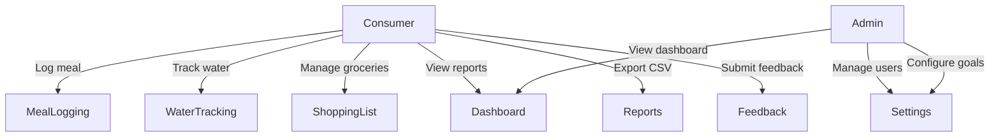
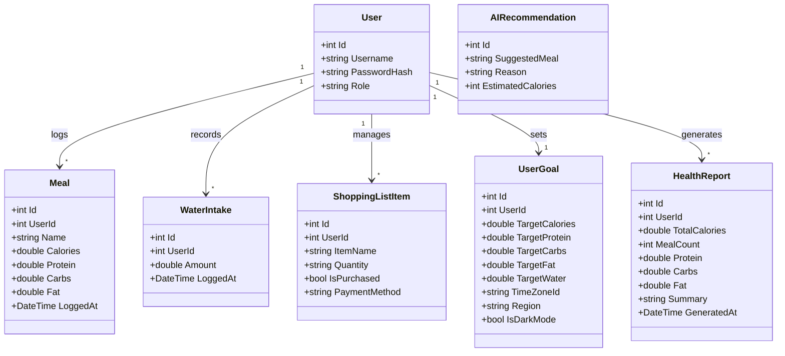
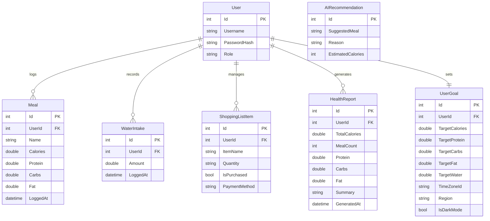

# SmartBite — PUSL2021 Computing Group Project Interim Report

---

## Chapter 01 — Introduction

### 1.1 Project Title
**SmartBite** — A Blazor-based Health Companion for Meal Logging, Water Tracking, and Grocery Planning.

### 1.2 Problem Statement
Individuals seeking to manage their nutrition lack a unified, lightweight tool that combines calorie tracking, hydration logging, grocery planning, and role-based administration in a single web application.

### 1.3 Objectives
1. Build a full-stack web application using .NET 10, Blazor Server, and ASP.NET Core Minimal APIs.
2. Implement persistent data storage with SQLite via Entity Framework Core.
3. Provide role-based access (Admin vs Consumer) with page-level restrictions.
4. Deliver CSV data exports and daily health summary reports.
5. Demonstrate clean architecture and team collaboration through a structured codebase.

### 1.4 Scope
- Meal logging with macro breakdown (calories, protein, carbs, fat).
- Water intake tracking with daily totals.
- Shopping list management with payment tagging and checkout tracker.
- Dashboard with aggregated daily statistics.
- Admin panel for user and goal management.
- Light/dark theming with mica/acrylic visual effects.

### 1.5 Out of Scope
- AI-powered nutrition estimates (attempted but API key was non-functional; deferred to future work).
- Mobile-native application.
- Offline/PWA support.

---

## Chapter 02 — System Analysis

### 2.1 Existing System
Most free nutrition trackers are mobile-only, ad-supported, and do not provide grocery planning or role-based access. There is no single open-source Blazor application that combines meal, water, grocery, and admin features.

### 2.2 Proposed System
SmartBite addresses these gaps by offering a unified web dashboard with:
- Meal, water, and grocery tracking in a single UI.
- Role-based access (Admin/Consumer) enforced at both UI and API levels.
- Persistent SQLite storage so data survives restarts.
- CSV export for offline analysis.

### 2.3 Use Case Diagram



---

## Chapter 03 — Requirements Specification

### 3.1 Functional Requirements
| ID | Requirement | Status |
| --- | --- | --- |
| FR-01 | Users can register and log in with username/password | ✅ Done |
| FR-02 | Consumers can log meals with calorie and macro data | ✅ Done |
| FR-03 | Consumers can log water intake | ✅ Done |
| FR-04 | Consumers can add, delete, and manage grocery items | ✅ Done |
| FR-05 | Dashboard shows daily calorie, protein, meal count, water summaries | ✅ Done |
| FR-06 | CSV export of meal and report data | ✅ Done |
| FR-07 | Admins can view/manage all users and configure goals | ✅ Done |
| FR-08 | Light/dark theme toggle with persistence | ✅ Done |

### 3.2 Non-Functional Requirements
| ID | Requirement |
| --- | --- |
| NFR-01 | Pages should load within 2 seconds on localhost |
| NFR-02 | UI must be responsive (Bootstrap 5 grid) |
| NFR-03 | Data must persist across application restarts (SQLite) |
| NFR-04 | Codebase must follow consistent C# and Razor conventions |

### 3.3 Technology Stack
| Component | Technology |
| --- | --- |
| Backend | ASP.NET Core Minimal APIs (.NET 10) |
| Frontend | Blazor Server (SignalR) |
| Database | SQLite via Entity Framework Core (`SmartBite.db`) |
| ORM | Entity Framework Core + `Microsoft.EntityFrameworkCore.Sqlite` v10.0.3 |
| Styling | Bootstrap 5, Bootstrap Icons, custom CSS (mica/acrylic) |
| Interop | `IJSRuntime` for theme toggle and file downloads |
| Hosting | .NET Aspire (`ServiceDefaults`) for service wiring |

---

## Chapter 04 — Feasibility Study

### 4.1 Operational Feasibility
- Target users are familiar with web dashboards and responsive layouts.
- Role separation (Admin/Consumer) mirrors real-world access needs.
- Minimal training required — UI follows standard card/form/table patterns.

### 4.2 Technical Feasibility
- .NET 10 + Blazor Server is a mature, well-documented stack.
- SQLite (`SmartBite.db`) provides lightweight persistent storage via EF Core; the schema can be migrated to SQL Server/PostgreSQL with only a connection string change.
- JS interop fills gaps where server-side Blazor is insufficient (theme, downloads).

### 4.3 Economical Feasibility
- All tools are free/open-source: .NET SDK, Bootstrap, EF Core, SQLite.
- No paid cloud dependency for development or local testing.

---

## Chapter 05 — System Architecture

### 5.1 High-Level Architecture

```
┌─────────────────────────────────────────────────┐
│                   Browser                       │
│  ┌───────────────────────────────────────────┐  │
│  │  Blazor Server (SignalR)                  │  │
│  │  MainLayout · NavMenu · Pages             │  │
│  │  UserSession · IJSRuntime interop         │  │
│  └────────────────┬──────────────────────────┘  │
└───────────────────┼─────────────────────────────┘
                    │ HTTP (SmartBiteApiClient)
┌───────────────────┼─────────────────────────────┐
│  computer_project.ApiService                    │
│  ┌────────────────┴──────────────────────────┐  │
│  │  ASP.NET Core Minimal APIs                │  │
│  │  /meals · /water · /shoppinglist          │  │
│  │  /stats · /goals · /users                 │  │
│  └────────────────┬──────────────────────────┘  │
│                   │                             │
│  ┌────────────────┴──────────────────────────┐  │
│  │  EF Core + SQLite (SmartBite.db)          │  │
│  │  AppDbContext                             │  │
│  └───────────────────────────────────────────┘  │
└─────────────────────────────────────────────────┘
```

### 5.2 Class Diagram



### 5.3 ER Diagram (SQL)



### 5.4 Database Technology
- **Engine**: SQLite (file-based, zero-configuration).
- **File**: `SmartBite.db` (created automatically by EF Core on first run).
- **ORM**: Entity Framework Core with `Microsoft.EntityFrameworkCore.Sqlite` v10.0.3.
- **Registration** (`Program.cs`):
  ```csharp
  builder.Services.AddDbContext<AppDbContext>(options =>
      options.UseSqlite("Data Source=SmartBite.db"));
  ```
- **Seed data**: `Program.cs` checks if the DB is empty on startup and inserts demo users, meals, water intakes, shopping items, and goals.

---

## Chapter 06 — Database Design & Normalisation

### 6.1 Schema Overview

The database contains 7 tables managed by `AppDbContext`:

| Table | Primary Key | Foreign Key | Description |
| --- | --- | --- | --- |
| Users | Id | — | Registered accounts (Admin or EndUser) |
| Meals | Id | UserId → Users.Id | Logged meals with calorie/macro data |
| WaterIntakes | Id | UserId → Users.Id | Logged water consumption entries |
| ShoppingListItems | Id | UserId → Users.Id | Grocery items with payment method |
| HealthReports | Id | UserId → Users.Id | Aggregated daily nutrition summaries |
| UserGoals | Id | UserId → Users.Id | Per-user calorie/macro/water targets and preferences |
| AIRecommendations | Id | — | AI-suggested meals (standalone, future use) |

### 6.2 First Normal Form (1NF)

All tables satisfy **1NF**: every column holds atomic (indivisible) values, each row is uniquely identified by a surrogate primary key (`Id`), and there are no repeating groups or arrays.

| Table | PK | Atomic Columns | Repeating Groups? |
| --- | --- | --- | --- |
| Users | Id | Username, PasswordHash, Role | ✗ None |
| Meals | Id | UserId, Name, Calories, Protein, Carbs, Fat, LoggedAt | ✗ None |
| WaterIntakes | Id | UserId, Amount, LoggedAt | ✗ None |
| ShoppingListItems | Id | UserId, ItemName, Quantity, IsPurchased, PaymentMethod | ✗ None |
| HealthReports | Id | UserId, TotalCalories, MealCount, Protein, Carbs, Fat, Summary, GeneratedAt | ✗ None |
| UserGoals | Id | UserId, TargetCalories, TargetProtein, TargetCarbs, TargetFat, TargetWater, TimeZoneId, Region, IsDarkMode | ✗ None |
| AIRecommendations | Id | SuggestedMeal, Reason, EstimatedCalories | ✗ None |

### 6.3 Second Normal Form (2NF)

All tables satisfy **2NF**: each uses a single-column surrogate PK (`Id`), making partial dependencies on a composite key impossible. Every non-key column depends on the entire primary key.

| Table | PK | Non-Key Columns | Partial Dependency? |
| --- | --- | --- | --- |
| Users | Id | Username, PasswordHash, Role | ✗ Single-column PK |
| Meals | Id | UserId, Name, Calories, Protein, Carbs, Fat, LoggedAt | ✗ Single-column PK |
| WaterIntakes | Id | UserId, Amount, LoggedAt | ✗ Single-column PK |
| ShoppingListItems | Id | UserId, ItemName, Quantity, IsPurchased, PaymentMethod | ✗ Single-column PK |
| HealthReports | Id | UserId, TotalCalories, MealCount, Protein, Carbs, Fat, Summary, GeneratedAt | ✗ Single-column PK |
| UserGoals | Id | UserId, TargetCalories, …, IsDarkMode | ✗ Single-column PK |
| AIRecommendations | Id | SuggestedMeal, Reason, EstimatedCalories | ✗ Single-column PK |

### 6.4 Third Normal Form (3NF)

All tables satisfy **3NF**: no non-key column transitively depends on the primary key through another non-key column. Foreign keys (`UserId`) reference the `Users` table directly and do not determine other non-key columns within the same table.

| Table | Transitive Dependency? | Notes |
| --- | --- | --- |
| Users | ✗ None | `Role` is a direct attribute of the user |
| Meals | ✗ None | `UserId` is an FK; Name, Calories, etc. depend only on `Meals.Id` |
| WaterIntakes | ✗ None | `Amount`, `LoggedAt` depend only on `WaterIntakes.Id` |
| ShoppingListItems | ✗ None | `ItemName`, `Quantity`, `IsPurchased`, `PaymentMethod` depend only on `ShoppingListItems.Id` |
| HealthReports | ✗ None | All aggregation fields depend only on `HealthReports.Id` |
| UserGoals | ✗ None | All target/preference fields depend only on `UserGoals.Id` |
| AIRecommendations | ✗ None | Standalone table — no FK, no transitive path |

### 6.5 Summary

The SmartBite database schema satisfies **1NF**, **2NF**, and **3NF**:
- All values are atomic with no repeating groups (1NF).
- Single-column surrogate PKs eliminate partial dependencies (2NF).
- No transitive dependencies exist between non-key columns (3NF).

The design is intentionally normalised to avoid data redundancy while keeping the schema simple enough for a health-tracking application.

---

## Chapter 07 — Development Tools and Technologies

### 7.1 Development Methodology
- **Iterative/incremental**: features added in vertical slices (UI + API + model per feature).
- **Source control**: Git on GitHub (`master` branch, feature-based commits).

### 7.2 Programming Languages and Tools

| Tool / Language | Purpose |
| --- | --- |
| C# 14 / .NET 10 | Backend API and Blazor UI logic |
| Razor (`.razor`) | Component markup and rendering |
| HTML / CSS | Layout, styling, mica/acrylic effects |
| JavaScript | Theme toggle and file download via `IJSRuntime` |
| PowerShell / dotnet CLI | Build, restore, run, watch |
| Visual Studio 2026 Insiders | Primary IDE |
| Git + GitHub | Version control and collaboration |

### 7.3 Third-Party Libraries

| Library | Version | Role |
| --- | --- | --- |
| Bootstrap 5 | 5.x (CDN) | Responsive grid, buttons, cards, dropdowns |
| Bootstrap Icons | 1.x (CDN) | Icon set (`bi bi-*`) |
| Entity Framework Core | 10.0.x | ORM for data access |
| Microsoft.EntityFrameworkCore.Sqlite | 10.0.3 | SQLite database provider |
| .NET Aspire (ServiceDefaults) | — | Shared service wiring and defaults |

---

## Chapter 08 — Implementation

### 8.1 Implemented Features

| Feature | Status | Key Files |
| --- | --- | --- |
| Meal logging | ✅ Done | `MealLogging.razor`, API `/meals` |
| Dashboard & reports | ✅ Done | `Dashboard.razor`, `Reports.razor`, API `/stats` |
| Water tracking | ✅ Done | `WaterTracking.razor`, API `/water` |
| Shopping list | ✅ Done | `ShoppingList.razor`, API `/shoppinglist` |
| Role-based access | ✅ Done | `UserSession.cs`, `ConsumerOnly.razor` |
| Light/dark theme | ✅ Done | `app.css`, JS interop in `MainLayout.razor` |
| Feedback page | ✅ Done | `Feedback.razor` |
| User registration/login | ✅ Done | `Login.razor`, `Register.razor`, API `/login`, `/users` |

### 8.2 Code Samples

**SQLite database registration** (`Program.cs`):
```csharp
builder.Services.AddDbContext<AppDbContext>(options =>
    options.UseSqlite("Data Source=SmartBite.db"));
```

**Meal logging endpoint** (`Program.cs`):
```csharp
app.MapPost("/meals", async (Meal meal, AppDbContext db) =>
{
    db.Meals.Add(meal);
    await db.SaveChangesAsync();
    return Results.Ok(meal);
});
```

**Blazor meal form** (`MealLogging.razor`):
```razor
<input class="form-control" @bind="newMealName" placeholder="e.g. Chicken Salad" />
<button class="btn btn-primary" @onclick="AddMeal">Log Meal</button>
```

### 8.3 Challenges Encountered and Solutions

| Challenge | Solution |
| --- | --- |
| Blazor Server loses connection on idle/network drop | Added reconnection error UI (`blazor-error-ui`) and reload prompt |
| AI API key integration attempted but unsuccessful | Moved AI features to future plans |
| Role checks scattered across pages | Centralised in `UserSession` and reusable `<ConsumerOnly>` component |
| Theme not persisting across renders | `ApplyTheme` called via `OnAfterRenderAsync`; JS interop sets `data-bs-theme` |
| First-run data setup | Seed data in `Program.cs` pre-populates SQLite on first launch |

### 8.4 Current Limitations
- **No real authentication**: passwords stored in plain text; no token/cookie-based auth.
- **Single-user demo**: most endpoints default to `UserId = 1`; no multi-user session isolation.
- **No automated tests**: no unit or integration test projects.
- **No AI features**: Google Gemini API key was configured but non-functional.
- **No offline support**: Blazor Server requires a live SignalR connection.

---

## Chapter 09 — Discussion & Future Work

### 9.1 Discussion
SmartBite demonstrates a working full-stack Blazor Server application with persistent SQLite storage, role-based access, and multiple health-tracking features. The mica/acrylic theme provides a modern aesthetic, and CSV exports allow users to take their data offline.

The primary gap is the lack of AI integration — the Google Gemini API key was configured but did not return results during development. This is the top priority for the next iteration.

### 9.2 Future Work
1. **AI integration**: Re-enable Google Gemini API for nutrition estimates, meal recommendations, and hydration advice.
2. **Database migration**: Move from SQLite to SQL Server or PostgreSQL for production scalability.
3. **Authentication**: Add ASP.NET Core Identity with password hashing and token-based auth.
4. **Multi-user isolation**: Scope all queries to the authenticated user.
5. **Automated testing**: Add unit tests (xUnit) and integration tests.
6. **Trend charts**: Add line/bar charts for weekly/monthly nutrition trends.
7. **PDF/Excel export**: Extend report exports beyond CSV.
8. **Push notifications**: Hydration and meal reminders.
9. **PWA/Offline**: Service worker for basic offline capability.

---

## References

1. Microsoft. (2025). *ASP.NET Core Blazor*. https://learn.microsoft.com/aspnet/core/blazor
2. Microsoft. (2025). *Entity Framework Core — SQLite Provider*. https://learn.microsoft.com/ef/core/providers/sqlite
3. Microsoft. (2025). *.NET Aspire overview*. https://learn.microsoft.com/dotnet/aspire
4. Bootstrap. (2024). *Bootstrap 5 documentation*. https://getbootstrap.com/docs/5.3
5. SQLite. (2024). *About SQLite*. https://sqlite.org/about.html

---

## Appendix A — Team Contribution Matrix

| No. | Area | Primary Files | Index No. | Owner |
| --- | --- | --- | --- | --- |
| 1 | Layout & responsiveness | `MainLayout.razor`, `MainLayout.razor.css`, `app.css` | 10967337 | DGJKM Madugalla |
| 2 | Theming pipeline | `MainLayout.razor`, `app.css`, `UserSession.cs` | 10967141 | Sathira lakshan |
| 3 | Navigation & routing | `NavMenu.razor`, `NavMenu.razor.css`, `app.css` | 10967134 | Rhls.dayananda |
| 4 | Session state | `UserSession.cs`, `MainLayout.razor` | 10967068 | KGSN Bandara |
| 5 | Auth flows | `Login.razor`, `Register.razor`, `Settings.razor`, `ConsumerOnly.razor` | 10967388 | Athukoralage Pabasara |
| 6 | Header actions | `MainLayout.razor` (quick actions), `SmartBiteApiClient.cs` | 10967136 | Abekon Abekon |
| 7 | Profile chip | `MainLayout.razor` (profile section), `UserSession.cs` | 10967387 | D.M.Nisansala Niroshani |
| 8 | Feedback / contact | `Feedback.razor`, `SmartBiteApiClient.cs`, `Program.cs`, `Models.cs` | 10967231 | BSB ABEYSOORIYA |
| 9 | API client & database | `SmartBiteApiClient.cs`, `Models.cs`, `Program.cs`, `AppDbContext.cs` | 10967199 | Sachitha Rathnayaka |
| 10 | Database design & SQL | `AppDbContext.cs`, `Models.cs`, `Program.cs` (SQLite config + seed data) | 10967175 | AMGG ADHIKARI |

---

## Appendix B — File Structure

```
computer_project.Web/              # Blazor UI
  Components/
    Layout/
      MainLayout.razor             — Shell layout
      NavMenu.razor                — Sidebar navigation
    Pages/
      Home.razor                   — Landing page
      Dashboard.razor              — Daily summary cards
      Feedback.razor               — Contact/help
      Settings.razor               — Admin panel
      ShoppingList.razor           — Grocery management
      MealLogging.razor            — Meal logging
      WaterTracking.razor          — Hydration tracking
      Reports.razor                — Detailed reports + CSV
      Labs.razor                   — Experimental features
      Login.razor                  — Login page
      Register.razor               — Registration page
  Services/
    UserSession.cs                 — Session state
  SmartBiteApiClient.cs            — HTTP client
  Models.cs                        — Client DTOs
  wwwroot/
    app.css                        — Theme CSS

computer_project.ApiService/       # Backend API
  Program.cs                       — Endpoints + SQLite config + seed data
  Models.cs                        — Entity classes
  Data/
    AppDbContext.cs                 — EF Core DbContext

computer_project.ServiceDefaults/  # Shared wiring
  Extensions.cs

computer_project.AppHost/          # Host bootstrap
  Program.cs
```
